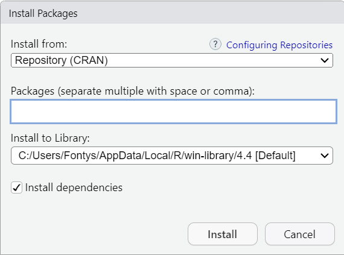
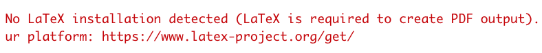
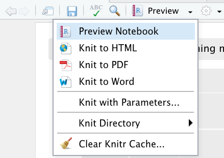

# Inhoud

In deze howto pagina worden de volgende onderwerpen besproken:

- [Installatie van R-studio]()
- [Notebooks en data importeren](#notebook-en-data-importeren)
- [Notebooks exporteren](#notebooks-exporteren)

---

## Locale installatie van R studio

Een locale installatie van R-studio aan te raden als je zelf controle wilt over welke libraries je wilt
kunnen installeren, je lokale bestanden makkelijk wilt kunnen gebruiken en als
je met diverse databronnen wilt kunnen koppelen.\
Ga je de verdieping ICT & Business doen, kies dan dit.\
Je moet hier **2 stappen** voor doen, in deze volgorde:

1.  Installeer de programmeertaal R.\
    Dit is de zogenaamde 'interpreter' die R code kan uitvoeren. Via [deze
    site](https://cloud.r-project.org/) kom je bij de download pagina uit.
    Check vervolgens welk besturingssysteem je nodig hebt en pak de meest
    recente installer (.exe voor Windows of .pkg voor Mac)

2.  Installeer de ontwikkelomgeving Rstudio.\
    Dit is de user interface waarin je handig je Notebooks (werkbestanden) kan
    bewerken, net zoiets als Visual Studio. Je kunt Rstudio [hier
    vinden](https://rstudio.com/products/rstudio/download/). Let op dat je de
    Free/Open Source versie pakt voor jouw besturingssysteem.

Let op: Je zult als je zelf installeert ook de juiste libraries moeten
installeren! Zie [deze HowTo](howto_install_libraries).

Kom je er niet uit? [Er zijn voldoende tutorials te
vinden](https://bfy.tw/QRhs).

---

## Installeren van bibliotheken

Bibliotheken zijn setjes voorgedefinieerde functionaliteit in R. Zie Rstudio als een kale Word of Excel, waarbij je de ribbon vult met knoppen door zelf libraries (of packages zoals programmeurs zeggen) toe te voegen. Libraries installeren hoef je alleen te doen als je RStudio zelf geïnstalleerd hebt op je eigen machine, of als je op RStudio Cloud werkt.

Op de FHICT RStudio server zijn de meeste libraries die je in de oriëntatie nodig hebt als het goed is al geïnstalleerd. Da hoef je dus geen libraries installeren tenzij je speciale dingen doet of misschien als je de verdieping volgt. Je moet een library wel importeren in je Notebook en de chunk uitvoeren om de inhoud van de library te kunnen gebruiken.

Omdat Notebooks geschikt zijn om over te dragen aan iemand anders en jouw bevindingen te reproduceren, moet die persoon ook weten welke libraries je daarvoor gebruikt hebt. Daarom laad je in ieder Notebook expliciet de benodigde libraries in.

### Verwijzen naar bibliotheken

Goed gebruik is om dat meteen in het begin van je document te doen en daar 1 chunk te maken waarin je de setup doet. Zoiets als hieronder dus:

> `library("tidyverse")`  
> `library("ggplot2")`

Dan komt een lezer niet halverwege allerlei nieuwe libraries tegen en heb je een goed beeld van de benodigde afhankelijkheden.

Als je losse chunks uitvoert in je Notebook is het handig om erop te letten dat je 'alles wat je nodig hebt' in een bepaalde chunk van te voren uitvoert.

### Installeren nieuwe bibliotheken

Krijg je een melding in je Notebook in de richting van `could not find..` of `could not load..` en heb je volgens jou wel de juiste library al opgenomen in je Notebook, dan heb je dikke kans dat je een library mist waaruit je functionaliteit probeert te gebruiken.

Libraries installeren **doe je niet vanuit een Notebook**, omdat dit een eenmalige actie is. Het gebruiken van een library doe je wel in je Notebook.

Installatie kan op 2 manieren:

- Via de GUI van RStudio.  
  Zoals je ziet kun je hier ook vinden welke libraries er al geïnstalleerd zijn.
  
  Klik op Install en vervolgens tik je de naam van de library in.
   { width:200px }

- Ben je iets meer nerd, wil je sneller aan de slag, of moet je eventuele installatie issues oplossen? Dan gebruik je uiteraard de console! Deze vind je standaard in het vak linksonder, en kun je ook altijd via het menu naar voren toveren als je dat vak per ongeluk uitgezet hebt.  
  In een `install.packages()` commando geef je dan aan welke library je wilt installeren, bijvoorbeeld:
  `install.packages("tidyverse")`

---

## Notebook en data importeren

In R gebruiken we eigenlijk altijd zogenaamde Notebooks. Dat zijn .Rmd (RMarkdown)
bestanden waar je uitleg, code (chunks) & output samen kunt voegen. Dit zorgt o.a.
voor herhaalbaarheid en leesbaarheid van je stappen, een hele verbetering t.o.v.
data analyse in MS Excel. Rstudio opent standaard niet met een Notebook. Dat moet
je zelf uploaden of aanmaken als je aan de slag gaat.

De workbooks bestaan uit 2 delen:

- **Opdrachtbeschrijving (PDF)**\
  Het opdrachbestand is als PDF bestand opgeslagen. Het bevat de opdrachtbeschrijving met daarin de voorbeelduitvoer. Aan het einde van de opdracht kun je eenzelfde PDF genereren vanuit jouw opdracht.

- **Databestand (ZIP)**\
  Het databestand bestaat uit de Excel bestanden met de data en een R-studio notebook als rmd-bestand.

- **Online versie:**\
  Heb je de online versie van R-studio, kies rechtsonder in het scherm voor de
  tab _Files_. Klik op de knop _Upload_. Browse naar de de map "downloads" en
  selecteer het Rmd-bestand. Als je op "ok" klikt, wordt het document ingeladen
  en zie je het tussen de bestanden staan. Klik erop en je dan wordt het
  zichbaar in het scherm linksboven. Voor het ophalen van de data klik je nog
  een keer op de knop _Upload_. Nu open je het zip databestand. R-studio zal het zip-bestand uitpakken en de
  databestanden los in het bestandsoverzicht zetten.

- **Lokale installatie:**\
  Als je R studio op je pc geïnstalleerd hebt, open je het bestand via het menu
  _File_/_Open_. Ga naar de map met downloads en open het Rmd-bestand. De
  databestanden zijn in dit geval beschikbaar in de map Downloads op je pc.
  Vraag hulp aan je docent om de bestanden op de goede plaats neer te zetten.
  Mogelijk moet de code van het notebook worden aangepast om de data succesvol
  in te lezen.

---

## Notebooks exporteren

Je kunt via R studio je Notebooks naar verschillende bestandsformaten: als HTML file of als PDF.
Belangrijk hierbij is om te weten wat er dan eigenlijk gebeurt en wat je moet checken.

Voor de uitvoer exporteren naar PDF heb je een aparte package nodig. Heb je die niet geïnstalleerd, dan krijg je de volgende foutmelding:
  
Installeer die package vanaf de console met het commando `tinytex::install_tinytex()`.

Als je op Knit to _..._ klikt zie je de exportformaten waarin je uitvoer kan worden geëxporteerd:
  
Bij het exporteren worden alle chunks achter elkaar uitgevoerd. Deze uitvoer wordt opgeslagen in een bestand in dezelfde directory als waar je .Rmd bestand staat.

Dingen waar je op moet letten, omdat dit fouten kan voorkomen:

- Alle **file referenties** voor bijvoorbeeld importeren van je dataset moeten kloppen! Alle files worden gezocht relatief t.o.v. de locatie waar je Notebook zich bevindt.
- Je zult expliciet een bestand, database of andere bron voor je dataset moeten laden in je Notebook via bijvoorbeeld de read_excel functie (alleen via het menu importeren en de data in het werkgeheugen van RStudio hebben staan werkt niet als je een Notebook knit).
- Foutmelding wijzen je vaak op potentiele issues, lees ze dus goed en Google eventueel wat ze betekenen. Er is een aantal functies die het wel doen als je je Notebook met de hand uitvoert, maar niet als je je Notebook knit (zoals de functie 'View').
- Notebooks waarbij authenticatie een rol speelt (API's) zijn tricky om te exporteren. Als een export draait, is er **geen interactie** mogelijk. Je moet je Notebook dan dus zo configureren dat er geen authenticatie o.i.d. nodig is.
- Om naar PDF te exporteren heb je een aparte package nodig. Heb je die niet, dan krijg je waarschijnlijk deze fout als je het toch probeert:
